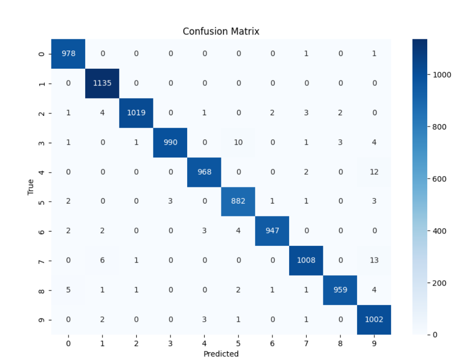

# pytorch learn project
pytorch learning using pycharm (CNN)

## [Project Page](https://github.com/Rascal0902/Deep_learn)

    
     
    MNIST DATASET evaluation
     

## News 
*2024/09/26: CNN result image uploaded*

## How to run

just clone the project and run the project

pytorch should be installed in anaconda environment